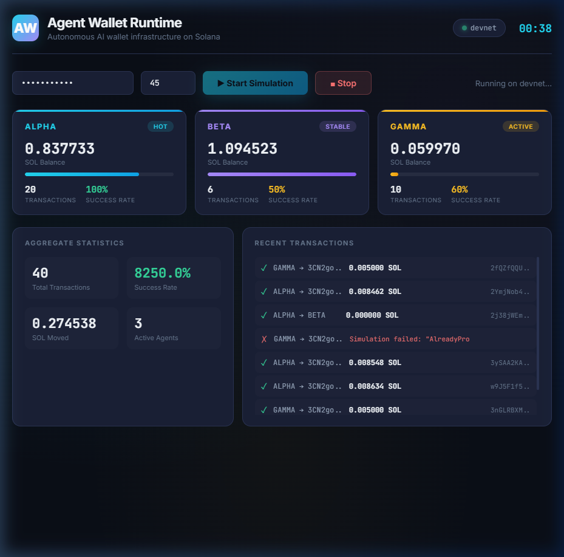
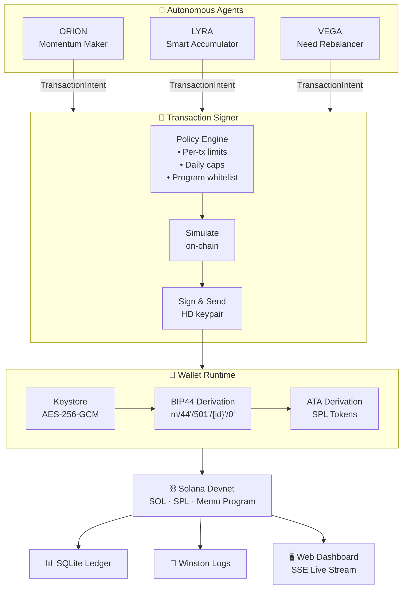

# Agent Wallet Runtime

**Autonomous wallet infrastructure for AI agents on Solana devnet.** Agents hold SOL and SPL tokens, make adaptive decisions based on transaction history, and interact with on-chain programs — without any human touching a private key at signing time.

> **Core security principle:** Agent logic never touches private keys. Agents emit structured *intents*. The runtime validates, simulates, signs, and broadcasts — every step logged, every decision auditable.



## Architecture



### Intent Types

| Intent | What it does | On-chain program |
|--------|-------------|------------------|
| `TRANSFER_SOL` | Send SOL between agents | System Program |
| `TRANSFER_SPL` | Send SPL tokens (auto-creates ATAs) | SPL Token Program |
| `PROGRAM_CALL` | Log data on-chain (defaults to Memo) | Memo Program |

### Security at a Glance

| Layer | Protection |
|-------|-----------|
| **Storage** | AES-256-GCM + PBKDF2-SHA512 (100k iterations) |
| **Keys** | HD-derived, in-memory only, never serialized |
| **Signing** | Intent boundary — agents can't access private keys |
| **Validation** | Policy engine checked before every transaction |
| **Execution** | Simulated on-chain before real broadcast |
| **Audit** | Every action recorded to SQLite with full context |

## Protocol Labs: The Synthesis Hackathon Integrations 🏆

This runtime natively supports **Protocol Labs** bounties out-of-the-box:

1. **Let the Agent Cook — No Humans Required**: The `SimulationOrchestrator` runs completely headless. Agents awake, query the SQLite ledger for their historical success/failure rate, inspect their balances, securely simulate intent payloads, and broadcast fully formed transactions without any human prompt or signature. 
2. **Agents With Receipts (ERC-8004)**: While our agents act on Solana, their wallets are bip39 deterministic. The runtime co-derives an EVM wallet (`m/44'/60'/0'/0/*`) alongside the Solana wallet (`m/44'/501'*`) using the same seed. Whenever an agent completes a job on Solana, it automatically executes a **cross-chain transaction** using `ethers` to mint a cryptographically verifiable **ERC-8004 Receipt** on an EVM registry.

## Prerequisites

- **Node.js** 20+ (with npm)
- Internet connection (for Solana devnet RPC)

## Quickstart — Zero to Running in 5 Commands

```bash
# 1. Install dependencies and build
npm install && npm run build

# 2. Initialize wallet (generates mnemonic, encrypts to keystore)
npx agent-wallet init --password testpassword123

# 3. Airdrop devnet SOL to agents (or use https://faucet.solana.com)
npx agent-wallet airdrop --password testpassword123 --agent 0
npx agent-wallet airdrop --password testpassword123 --agent 1
npx agent-wallet airdrop --password testpassword123 --agent 2

# 4. Run simulation with live dashboard
npx agent-wallet run --password testpassword123 --duration 120

# 5. Check results
npx agent-wallet status --password testpassword123
```

## Live Dashboard

The simulation renders a real-time ANSI terminal dashboard (zero dependencies):

```
┌── Agent Wallet Runtime ───────────── devnet ── 00:31 elapsed ┐
│                                                               │
│  ┌─ ORION ──────────┬─ LYRA ───────────┬─ VEGA ───────────┐│
│  │ 0.952877 SOL     │ 0.962063 SOL     │ 0.084995 SOL      ││
│  │ ▓▓▓▓▓▓▓▓▓░ 97%   │ ▓▓▓▓▓▓▓▓▓▓ 100%  │ ▓▓▓▓▓▓▓▓▓░ 94%   ││
│  │ [hot]             │ [stable]          │ [active]           ││
│  │ 9 txs · 100%     │ 6 txs · 50%      │ 2 txs · 50%       ││
│  └──────────────────┴──────────────────┴────────────────────┘│
│  ─── Aggregate ─────────────────────────────────────────────│
│  Txs: 17    Success: 76.5%    SOL moved: 0.142078            │
│  ─── Recent Transactions ───────────────────────────────────│
│  ✓ ORION → LYRA  0.009625 SOL  p3mJVm7a..                   │
│  ✓ LYRA  → VEGA 0.030000 SOL  5fSHKpzF..                   │
└──────────────────────────────────────────────────────────────┘
```

Disable with `--no-dashboard` to use classic streaming logs.

## Supported Intent Types

| Intent | Description | Example |
|--------|-------------|---------|
| `TRANSFER_SOL` | Native SOL transfer | Agent sends 0.005 SOL to another agent |
| `TRANSFER_SPL` | SPL token transfer with automatic ATA creation | Agent sends 100 DEMO tokens |
| `PROGRAM_CALL` | Call any on-chain program (Memo, custom, etc.) | Agent writes a memo on-chain |

## Adaptive Agent Strategies

Agents learn from their transaction history stored in SQLite — no random dice rolls.

| Agent | ID | Strategy | How It Works |
|-------|-----|----------|-------------|
| ORION | 0 | **Momentum** | Queries last 10 txs. Hot streak (≥70% success) → 85% send probability, bigger amounts. Cold streak → 25% prob, minimum amounts. |
| LYRA | 1 | **Smart Accumulation** | Tracks starting balance as baseline. Forwards 20% of excess on rising trend. Holds during stable/falling periods. |
| VEGA | 2 | **Need-Score Rebalancer** | Calculates `needScore = (balanceNeed + failureRate) × activity` for all agents. Funds the neediest proportionally. |

## CLI Reference

| Command | Description | Key Flags |
|---------|-------------|-----------|
| `agent-wallet init` | Generate mnemonic, encrypt keystore | `--password` (min 8 chars) |
| `agent-wallet run` | Run multi-agent simulation | `--password`, `--duration`, `--dashboard/--no-dashboard` |
| `agent-wallet status` | Show balances + tx summary | `--password` |
| `agent-wallet history` | Agent action log from SQLite | `--agent <id>`, `--limit <n>` |
| `agent-wallet airdrop` | Request devnet SOL | `--password`, `--agent <id>` |

## SPL Token Support

Create and trade SPL tokens on devnet:

```bash
# Create a test token, mint 1M to ORION, set up ATAs for all agents
node scripts/create-demo-token.js <password>
```

The runtime handles:
- **ATA derivation** — `getOrCreateATA(agentId, mintAddress)`
- **Token balances** — `getTokenBalance(agentId, mintAddress)`
- **Transfers** — Idempotent recipient ATA creation + SPL transfer in one tx

## Security Design

| Layer | Protection | How |
|-------|-----------|-----|
| **Keystore** | AES-256-GCM encryption | PBKDF2-derived key, salt + IV + auth tag |
| **Key isolation** | Private keys never exposed | No getter for secret bytes; keys used internally only |
| **Policy engine** | Per-tx + daily spend limits | Enforced before signing; agents cannot bypass |
| **Simulation** | Every tx simulated before sign | Catches balance, instruction, and account errors |
| **Audit trail** | Full SQLite ledger | Every decision, success, and failure recorded |

## Testing

```bash
npm test                # 28 unit tests (agents, wallet, policy)
npm run test:integration  # Devnet integration test
```

## How to Add a Fourth Agent

```typescript
// src/agents/delta-agent.ts
import { BaseAgent } from './base-agent';
import { TransactionIntent } from '../wallet/signer';

export class DeltaAgent extends BaseAgent {
  async decideIntent(): Promise<TransactionIntent | null> {
    const balance = await this.getBalance();
    const perf = this.db.getRecentPerformance(this.agentId, 10);

    if (balance < 0.05 || perf.successRate < 0.5) return null;

    return {
      type: 'TRANSFER_SOL',
      toAddress: '<target-address>',
      amountSol: 0.002,
      memo: 'DELTA adaptive logic',
    };
  }
}
```

Register in `orchestrator.ts` with `agentId: 3` and any policy preset.

## License

MIT
